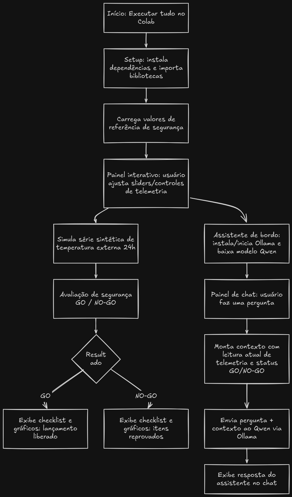

# Aurora Siger - Fase 1 - Murilo Dias
Projeto de verificação de dados de telemetria e discussão sobre energia, sustentabilidade e IA.

## Instruções

1. Baixar o arquivo aurora_singer.ipynb
2. Importar no Google Colab
3. Ambiente de execução -> Executar tudo. Depois, é só mudar os valores nos controles do painel e o resultado (checklist e gráficos) atualizará em tempo real.
4. Para a Borealis (assistente de bordo), certifique-se que o setup está correto. Recomendado alterar o runtime para usar uma TPU ou GPU, já que o modelo roda no próprio Colab.

## Algoritmo

## Testes

### Algoritmo e gráficos
https://github.com/user-attachments/assets/fd2ef53d-0a35-452f-88ef-e1cdc5db1342

### Borealis, a IA assistente de bordo
https://github.com/user-attachments/assets/5dcaf1e4-d553-4a85-ab17-55726ec28537

